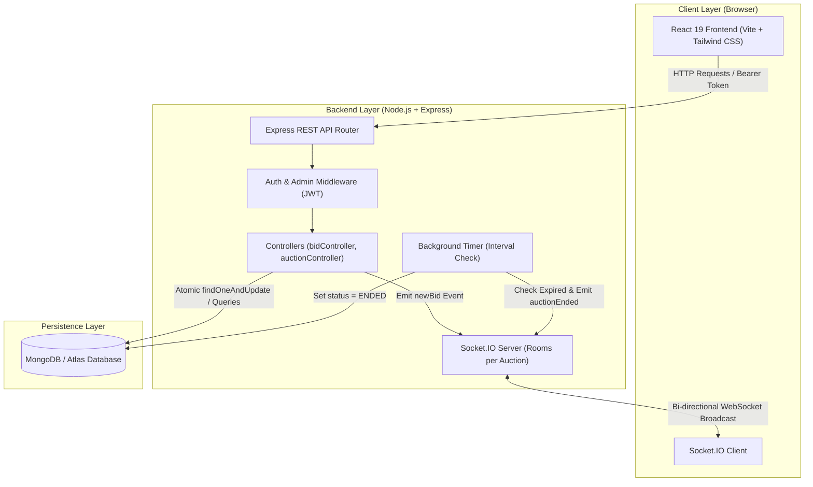

# ⚡ BidLive — Real-Time Multi-Auction System

BidLive is a real-time multi-auction MERN stack application (MongoDB, Express, React, Node.js) paired with Socket.IO. It enables users to browse active auctions, place bids in real time with sub-second WebSocket updates, view bid history, and track won items. Administrators can create and update auction listings.

The application is engineered with atomic database operations to eliminate bid race conditions and enforce data integrity under concurrent high-volume traffic.

---

## 🌐 Live Demo & Deployment Links

* **Live Frontend Web Application (Vercel):** `https://<your-app>.vercel.app` *(Example: `https://bidlive-gamma.vercel.app`)*
* **Live Backend API & WebSocket Server (Render):** `https://<your-backend>.onrender.com` *(Example: `https://bidlive-zkq0.onrender.com`)*
* **Database Cluster:** MongoDB Atlas Cloud Cluster

---

## ✨ Features

### 👤 User Features
* **User Authentication:** Secure signup and login with bcrypt password hashing and JWT Bearer token authentication.
* **Live Auction Browsing:** Browse active, upcoming, and ended auctions with real-time countdown timers.
* **Auction Details & History:** View item descriptions, starting prices, current high bids, minimum bid increments, and complete bid history logs.
* **My Bids Dashboard:** Track active bids placed across all auctions (`/my-bids`).
* **My Wins Dashboard:** View auctions won by the current user upon auction closure (`/my-wins`).

### ⚙️ Admin Features
* **Role-Based Access Control:** Restricted endpoints enforced server-side via `adminMiddleware` (`role === 'admin'`).
* **Create Auction Items:** Create new auction listings specifying item title, description, image URL, starting price, minimum increment, start time, and end time.
* **Update Existing Auctions:** Modify item details, prices, and end times. Updating `startingPrice` on un-bid auctions dynamically syncs `currentBid`.

### 📡 Real-Time Features (Socket.IO)
* **Sub-second Bid Synchronization:** Live bids are immediately broadcasted to all connected clients in the auction room (`auction:<auctionId>`) without requiring browser refreshes.
* **Automated Auction End Events:** Background timer emits `auctionEnded` events when an auction reaches its `endTime`, crowning the leading bidder as winner in real time.
* **Multi-Tab Sync:** Prevents double rendering across multiple browser tabs using unique bid document IDs (`_id`/`id`).

### 🔒 Concurrency & Data Integrity
* **Atomic DB Concurrency:** Uses MongoDB `findOneAndUpdate()` with `$expr` query conditions to guarantee atomicity during simultaneous bid attempts.
* **Idempotency Protection:** Enforces a unique, sparse index on `requestId` in the `Bid` schema to prevent network retries or double-clicks from creating duplicate bid records.
* **State Compensation Rollback:** Implements conditional rollback handling if bid history creation fails following an auction update.

---

## 🏗️ Technical Architecture

### Architecture Diagram



### System Layer Description
1. **Client Layer (React 19 + Vite):** Handles UI rendering, user interactions, optimistic state updates, and real-time WebSocket room subscriptions (`auction:<auctionId>`).
2. **REST API & Middleware Layer (Express 5):** Validates incoming requests, parses JSON payloads, verifies JWT Bearer tokens, and enforces role-based authorization.
3. **Real-Time Engine (Socket.IO 4):** Manages room joins (`joinAuction`/`joinRoom`) and broadcasts real-time events (`newBid`, `auctionEnded`).
4. **Database & Persistence Layer (MongoDB / Mongoose 9):** Persists application state. Uses atomic query expressions for concurrency control and sparse unique indexes for idempotency.

### Project Directory Structure

```
bidlive/
├── backend/                # Express.js & Socket.IO server
│   ├── controllers/        # Controllers (authController, auctionController, bidController)
│   ├── middleware/         # Auth & Admin JWT middlewares
│   ├── models/             # Mongoose Schemas (User, Item, Auction, Bid)
│   ├── routes/             # Express API routes
│   ├── socket/             # Socket.IO connection & timer handlers
│   ├── tests/              # Automated test scripts (concurrent-bids.js, edge-cases-test.js)
│   ├── seed.js             # Database seeding script
│   └── server.js           # Main application entry point
├── frontend/               # React 19 + Vite frontend
│   ├── src/                # Components, Pages, Services (api.js)
│   ├── package.json        # Frontend dependencies
│   └── vercel.json         # Vercel SPA routing rewrites
├── PRD.md                  # Product Requirements Document
├── setup.md                # Setup & developer guide
└── README.md               # System documentation
```

---

## 🛠️ Technical Approach & Lifecycle Execution

### 1. Step-by-Step Bid Execution Flow
When a user clicks "Place Bid":

```
[ Client ] ──(POST /api/auctions/:id/bids + Token + requestId)──> [ Express Router ]
                                                                        │
[ Client UI Updates ] <──(Emit 'newBid')── [ Socket.IO ] <── [ Atomic findOneAndUpdate ]
```

1. **Client Request:** The client sends an HTTP `POST` to `/api/auctions/:auctionId/bids` with the bid `amount`, optional client-generated `requestId`, and `Authorization: Bearer <token>` header.
2. **JWT Authorization:** `authMiddleware` verifies the JWT token, extracts user identity (`req.user.id`), and attaches it to the request object.
3. **ObjectId & Amount Validation:** `bidController.js` validates that `auctionId` is a valid 24-char hex MongoDB `ObjectId` and `amount` is a positive number.
4. **Idempotency Check:** If `requestId` is present, `bidController.js` queries `Bid.findOne({ requestId, auctionId, userId })`. If found, it immediately returns the existing bid payload (**HTTP 200 OK**).
5. **Server-Side Timing & Status Check:** The controller fetches the auction and verifies server time: `now >= startTime` and `now < endTime`.
6. **Minimum Bid Calculation:**
   - If no bids exist yet (`currentWinner == null`), minimum required bid is `startingPrice`.
   - If bids already exist (`currentWinner != null`), minimum required bid is `currentBid + minimumIncrement`.
7. **Atomic DB Concurrency Update:**
   The backend executes an atomic `Auction.findOneAndUpdate()` with an `$expr` query condition:
   ```javascript
   Auction.findOneAndUpdate(
     {
       _id: auctionId,
       startTime: { $lte: now },
       endTime: { $gt: now },
       $or: [
         {
           $and: [
             { $or: [{ currentWinner: null }, { currentWinner: { $exists: false } }] },
             { $expr: { $gte: [numericAmount, '$startingPrice'] } }
           ]
         },
         {
           $and: [
             { currentWinner: { $ne: null } },
             {
               $expr: {
                 $gte: [
                   numericAmount,
                   { $add: ['$currentBid', { $ifNull: ['$minimumIncrement', minIncrement] }] }
                 ]
               }
             }
           ]
         }
       ]
     },
     { $set: { currentBid: numericAmount, currentWinner: userId, status: 'ACTIVE' } },
     { new: true }
   );
   ```
8. **Bid History Record & Rollback:**
   Upon successful auction update, `Bid.create({ auctionId, userId, amount, requestId })` is called. If `Bid.create()` fails, a conditional rollback (`Auction.findOneAndUpdate({ _id: auctionId, currentBid: numericAmount, currentWinner: userId }, { $set: { currentBid: previousBid, currentWinner: previousWinner } })`) reverts the auction state if no subsequent bid has advanced it.
9. **Socket.IO Real-Time Broadcast:**
   `io.to('auction:' + auctionId).emit('newBid', { auctionId, amount, user, bidderName, createdAt })` broadcasts the new bid to all connected clients in the auction room.
10. **Client UI State Update:**
    Clients in the room receive the `newBid` event. `AuctionDetails.jsx` checks unique bid `_id`/`id` to prevent double-rendering and updates the highest bid UI state.

### 2. Auction End & Winner Selection Logic
* **Server-Authoritative Status (`calculateStatus`):** The server dynamically computes status based on server system time:
  - `now < startTime` $\rightarrow$ `UPCOMING`
  - `now >= startTime` and `now < endTime` $\rightarrow$ `ACTIVE`
  - `now >= endTime` $\rightarrow$ `ENDED`
* **Background Expiration Job:** `socket/socket.js` runs an interval timer every 10 seconds. It queries `Auction.find({ endTime: { $lte: now }, status: { $ne: 'ENDED' } })`, updates `status = 'ENDED'`, and emits `auctionEnded` to room `auction:<auctionId>` with winner details (`currentWinner`).

---

## 🗄️ Database & Schema Design

### Collections Overview

```
 ┌─────────────┐       1:1       ┌─────────────┐
 │    User     │ ───────────────> │   Auction   │
 └─────────────┘                 └─────────────┘
        │                               │
        │ 1:N                           │ 1:N
        v                               v
 ┌─────────────┐                 ┌─────────────┐
 │     Bid     │ <────────────── │    Item     │
 └─────────────┘                 └─────────────┘
```

#### 1. `users` Collection (`models/User.js`)
| Field | Type | Attributes / Index | Description |
|---|---|---|---|
| `_id` | ObjectId | Primary Key | Auto-generated user ID |
| `name` | String | Required, Trimmed | Full name of user |
| `email` | String | Required, Unique, Lowercase, Trimmed | Account email address |
| `password` | String | Required | Bcrypt hashed password (salt factor 10) |
| `role` | String | Enum: `['user', 'admin']`, Default: `'user'` | Role-based authorization flag |
| `createdAt` | Date | Timestamps | Document creation timestamp |
| `updatedAt` | Date | Timestamps | Document last update timestamp |

#### 2. `items` Collection (`models/Item.js`)
| Field | Type | Attributes | Description |
|---|---|---|---|
| `_id` | ObjectId | Primary Key | Auto-generated item ID |
| `name` | String | Required, Trimmed | Name of auction item |
| `description` | String | Default: `''` | Detailed item specifications |
| `image` | String | Default: `''` | Item image URL |

#### 3. `auctions` Collection (`models/Auction.js`)
| Field | Type | Attributes / Index | Description |
|---|---|---|---|
| `_id` | ObjectId | Primary Key | Auto-generated auction ID |
| `itemId` | ObjectId | Ref: `'Item'` | Reference to associated Item document |
| `title` | String | Trimmed | Auction title |
| `description` | String | Default: `''` | Auction description |
| `imageUrl` | String | Default: `''` | Media image URL |
| `startingPrice` | Number | Required, Min: 0 | Initial base price |
| `minimumIncrement` | Number | Default: 100, Min: 1 | Minimum bid increment |
| `currentBid` | Number | Default: 0 | Current highest bid amount |
| `currentWinner` | ObjectId | Ref: `'User'`, Default: `null` | Current leading high bidder |
| `startTime` | Date | Required | Auction start timestamp |
| `endTime` | Date | Required | Auction end timestamp |
| `status` | String | Enum: `['UPCOMING', 'ACTIVE', 'ENDED']` | Calculated status |

#### 4. `bids` Collection (`models/Bid.js`)
| Field | Type | Attributes / Index | Description |
|---|---|---|---|
| `_id` | ObjectId | Primary Key | Auto-generated bid ID |
| `auctionId` | ObjectId | Ref: `'Auction'`, Required | Reference to targeted auction |
| `userId` | ObjectId | Ref: `'User'`, Required | Reference to bidding user |
| `amount` | Number | Required | Bid numerical amount |
| `requestId` | String | **Unique, Sparse Index** | Client idempotency identifier |
| `createdAt` | Date | Timestamps | Bid submission timestamp |

---

## 📡 API Documentation

### 1. Register User
* **Endpoint:** `POST /api/auth/register`
* **Access:** Public
* **Headers:** `Content-Type: application/json`
* **Request Body:**
  ```json
  {
    "name": "Jane Doe",
    "email": "jane@example.com",
    "password": "securepassword123"
  }
  ```
* **Success Response (HTTP 201 Created):**
  ```json
  {
    "message": "User registered successfully",
    "token": "eyJhbGciOiJIUzI1NiIsInR5cCI6IkpXVCJ9...",
    "user": {
      "id": "6741b2c4e3b0c44298fc1c14",
      "name": "Jane Doe",
      "email": "jane@example.com",
      "role": "user"
    }
  }
  ```
* **Error Response (HTTP 400 Bad Request):**
  ```json
  { "message": "User with this email already exists." }
  ```

### 2. Login User
* **Endpoint:** `POST /api/auth/login`
* **Access:** Public
* **Headers:** `Content-Type: application/json`
* **Request Body:**
  ```json
  {
    "email": "jane@example.com",
    "password": "securepassword123"
  }
  ```
* **Success Response (HTTP 200 OK):**
  ```json
  {
    "message": "Login successful",
    "token": "eyJhbGciOiJIUzI1NiIsInR5cCI6IkpXVCJ9...",
    "user": {
      "id": "6741b2c4e3b0c44298fc1c14",
      "name": "Jane Doe",
      "email": "jane@example.com",
      "role": "user"
    }
  }
  ```
* **Error Response (HTTP 401 Unauthorized):**
  ```json
  { "message": "Invalid email or password." }
  ```

### 3. List All Auctions
* **Endpoint:** `GET /api/auctions`
* **Access:** Public
* **Success Response (HTTP 200 OK):**
  ```json
  [
    {
      "_id": "6abb768646a4fa97bfa14260",
      "title": "iPhone 15 Pro Max - 256GB",
      "startingPrice": 40000,
      "minimumIncrement": 1000,
      "currentBid": 53000,
      "currentWinner": { "_id": "6741b2...", "name": "Bidder User 1" },
      "status": "ACTIVE",
      "startTime": "2026-09-29T10:00:00.000Z",
      "endTime": "2026-09-30T10:00:00.000Z"
    }
  ]
  ```

### 4. Create Auction Item (Admin Only)
* **Endpoint:** `POST /api/auctions`
* **Access:** Admin (`Authorization: Bearer <admin_token>`)
* **Headers:** `Content-Type: application/json`
* **Request Body:**
  ```json
  {
    "title": "MacBook Pro 14\" M3",
    "description": "Space Black, 16GB RAM, 512GB SSD",
    "imageUrl": "https://example.com/macbook.jpg",
    "startingPrice": 100000,
    "minimumIncrement": 2000,
    "startTime": "2026-09-29T12:00:00.000Z",
    "endTime": "2026-10-01T12:00:00.000Z"
  }
  ```
* **Success Response (HTTP 201 Created):**
  ```json
  {
    "message": "Auction created successfully",
    "auction": { "_id": "6abb...", "title": "MacBook Pro 14\" M3", "status": "ACTIVE" }
  }
  ```
* **Error Response (HTTP 403 Forbidden):**
  ```json
  { "message": "Access denied. Admin rights required." }
  ```

### 5. Place Bid on Auction
* **Endpoint:** `POST /api/auctions/:auctionId/bids`
* **Access:** Authenticated User (`Authorization: Bearer <user_token>`)
* **Headers:** `Content-Type: application/json`
* **Request Body:**
  ```json
  {
    "amount": 54000,
    "requestId": "unique_req_uuid_12345"
  }
  ```
* **Success Response (HTTP 201 Created):**
  ```json
  {
    "message": "Bid placed successfully!",
    "bid": {
      "_id": "6abb...",
      "auctionId": "6abb768646a4fa97bfa14260",
      "amount": 54000,
      "requestId": "unique_req_uuid_12345",
      "userId": { "name": "Jane Doe", "email": "jane@example.com" }
    }
  }
  ```
* **Error Response (HTTP 400 Bad Request):**
  ```json
  { "message": "Bid rejected. A higher bid was placed or auction status changed." }
  ```
* **Invalid ID Format Error (HTTP 400 Bad Request):**
  ```json
  { "message": "Invalid auction ID format." }
  ```

---

## ⚙️ Environment Variables

> **Notice:** Never commit real secrets or credentials to source control repositories.

### Backend (`backend/.env`)
```env
PORT=5000
MONGO_URI=mongodb://127.0.0.1:27017/bidlive
# For MongoDB Atlas Cloud Cluster:
# MONGO_URI=mongodb+srv://<username>:<password>@<cluster>.mongodb.net/bidlive?retryWrites=true&w=majority
JWT_SECRET=your_jwt_secret_key_here
CLIENT_URL=http://localhost:5173
NODE_ENV=development
```

### Frontend (`frontend/.env`)
```env
VITE_API_URL=http://localhost:5000
```

---

## 💡 Important Technical Decisions & Architecture Trade-offs

1. **Why MongoDB?**
   - Flexible document model suits nested auction items and populated references (`populate('itemId')`).
   - Supports query-level expression evaluation (`$expr`) required for atomic single-document updates.
2. **Why Socket.IO instead of polling?**
   - Polling generates excessive HTTP overhead under high user concurrency. Socket.IO room subscriptions (`auction:<auctionId>`) provide sub-100ms real-time broadcasts only to users actively viewing a specific item.
3. **Why Atomic `findOneAndUpdate` instead of locks?**
   - Explicit row locks (or Redis distributed locks) introduce locking latency, deadlock risks, and infrastructure complexity. MongoDB's single-document atomic update semantics execute at the database level without external locking overhead.
4. **Why JWT Authentication?**
   - Stateless JWT tokens eliminate server-side session storage bottlenecks, making backend scaling across container environments straightforward.

---

## ⚡ How Simultaneous Bids Are Handled

### The Race Condition Problem
When two bidders submit identical bid amounts (e.g. ₹50,000) at the exact same millisecond:
- In standard read-then-write logic, both requests see current bid as ₹45,000, validate ₹50,000 as valid, and both update the database.
- Result: Overwritten state and duplicate high bids.

### The Solution: Atomic `$expr` Query Condition
BidLive executes the update atomically inside the database engine:
```javascript
Auction.findOneAndUpdate(
  {
    _id: auctionId,
    startTime: { $lte: now },
    endTime: { $gt: now },
    $or: [
      {
        $and: [
          { $or: [{ currentWinner: null }, { currentWinner: { $exists: false } }] },
          { $expr: { $gte: [numericAmount, '$startingPrice'] } }
        ]
      },
      {
        $and: [
          { currentWinner: { $ne: null } },
          {
            $expr: {
              $gte: [
                numericAmount,
                { $add: ['$currentBid', { $ifNull: ['$minimumIncrement', minIncrement] }] }
              ]
            }
          }
        ]
      }
    ]
  },
  { $set: { currentBid: numericAmount, currentWinner: userId } },
  { new: true }
);
```

### Outcome for Simultaneous Requests
- **Winning Request:** The database engine processes the first update, setting `currentBid = 50000`. Returns the updated document (HTTP 201 Created).
- **Losing Request:** The second update evaluates `$expr: { $gte: [50000, 50000 + 1000] }` which returns `false`. `findOneAndUpdate` returns `null`. The controller catches this and returns **HTTP 400 Bad Request** (*"Bid rejected. A higher bid was me..."*).

### Honest Crash Analysis of Rollback Logic
`bidController.js` executes an atomic conditional rollback if `Bid.create()` fails after `findOneAndUpdate()` succeeds:
```javascript
await Auction.findOneAndUpdate(
  { _id: auctionId, currentBid: numericAmount, currentWinner: userId },
  { $set: { currentBid: previousBid, currentWinner: previousWinner } }
);
```
- **If `Bid.create()` fails due to DB validation/duplicate index:** The conditional rollback safely restores the previous auction state if no newer bid has advanced it.
- **Hard Process Crash Limitation:** If the Node.js server process physically crashes or loses power at the *exact millisecond* between `Auction.findOneAndUpdate()` and `Bid.create()`, the auction `currentBid` will remain updated without a corresponding `Bid` document unless MongoDB multi-document ACID transactions with replica sets are enabled.

---

## 🧪 Testing Commands & Results

### 1. Run Atomic Concurrency Test
Verifies simultaneous identical bids on the same auction:
```bash
cd backend
node tests/concurrent-bids.js
```
*Sample Output:*
```text
⚡ Starting Concurrent Bidding Test...
Step 1: Logging in Bidder A and Bidder B...
Step 2: Fetching active auction...
Targeting Auction: "Apple Watch Ultra 2"
Current Bid: ₹68000 | Min Increment: ₹1000
Step 3: Launching SIMULTANEOUS concurrent bids of ₹69000...
================ TEST RESULTS ================
✅ SUCCESS: Bidder A's bid was ACCEPTED (Status 201)
❌ REJECTED: Bidder B's bid was REJECTED (Status 400)
==============================================
🎉 Concurrency test completed! MongoDB atomic findOneAndUpdate correctly allowed only 1 winner.
```

### 2. Run Comprehensive 11 Edge Cases Suite
Verifies all assignment-required edge cases:
```bash
cd backend
node tests/edge-cases-test.js
```

### 3. Run Production Frontend Build Check
Verifies JSX syntax and production bundling:
```bash
cd frontend
npm run build
```

---

## Edge Cases and Error Handling

| Edge Case | How BidLive Handles It | Validation or Test Performed | Current Status |
| :--- | :--- | :--- | :--- |
| **1. Multiple users bidding on same auction** | Handles sequential bids with real-time Socket.IO broadcasts and state updates. | Verified via `edge-cases-test.js` Case 1. | **PASS** |
| **2. Multiple bids arriving simultaneously** | Uses atomic `findOneAndUpdate()` with `$expr` price conditions. 1 succeeds (HTTP 201), duplicate is rejected (HTTP 400). | Verified via `concurrent-bids.js` & `edge-cases-test.js` Case 2. | **PASS** |
| **3. Bid lower than current highest bid** | Controller validates `numericAmount >= minRequiredBid` and returns HTTP 400 Bad Request. | Verified via `edge-cases-test.js` Case 3. | **PASS** |
| **4. Attempting to bid after auction ended** | Checks `endTime <= now` in controller and `endTime: { $gt: now }` in DB query. Returns HTTP 400. | Verified via `edge-cases-test.js` Case 4. | **PASS** |
| **5. Duplicate bid request (Same requestId)** | Scopes `requestId` check to user & auction with sparse unique index. Returns HTTP 200 with cached payload. | Verified via `edge-cases-test.js` Case 5. | **PASS** |
| **6. Multiple browser tabs open on same auction** | `AuctionDetails.jsx` socket listener deduplicates incoming `newBid` events using unique bid `_id`/`id`. | Verified via `edge-cases-test.js` Case 6. | **PASS** |
| **7. Current bid changes while placing bid** | Atomic DB update condition fails for stale bid amount and returns HTTP 400 with updated price error. | Verified via `edge-cases-test.js` Case 7. | **PASS** |
| **8. Multiple auctions ending simultaneously** | Socket.IO timer checks expired auctions independently and broadcasts isolated `auctionEnded` events per room. | Verified via `edge-cases-test.js` Case 8. | **PASS** |
| **9. Invalid auction ID** | Validates ObjectId format before querying. Returns clean HTTP 400 Bad Request (`Invalid auction ID format.`). | Verified via `edge-cases-test.js` Case 9. | **PASS** |
| **10. Server or API failure during bidding** | `bidController.js` implements atomic conditional rollback (`findOneAndUpdate`) if `Bid` document creation fails. | Verified via `edge-cases-test.js` Case 10. | **PASS** |
| **11. No active auctions available** | `GET /api/auctions` returns empty array `[]`. `Auctions.jsx` displays friendly empty state UI. | Verified via `edge-cases-test.js` Case 11. | **PASS** |

---

## ⚠️ Known Limitations

1. **Free-Tier Hosting Cold Start:** Free hosting (e.g. Render free tier) spins down after 15 minutes of inactivity, causing an initial 30–50 second cold-start delay on first request.
2. **Server Timer After Restart:** The background auction expiration checker runs on a 10-second `setInterval`. If the server is offline when an auction expires, status is finalized on the next server tick upon restart.
3. **In-Memory MongoDB Fallback:** If local MongoDB is not running, the backend falls back to `mongodb-memory-server` in RAM for testing (data resets when process stops).
4. **No Multi-Document ACID Transactions:** Relies on single-document atomic update queries + compensation rollback because standalone MongoDB instances without replica sets do not support multi-document transactions.
5. **Basic Role-Based Admin Auth:** Admin access relies on user document `role === 'admin'` without fine-grained permissions.

---

## 🚀 What I Would Improve With More Time

1. **Redis Pub/Sub Adapter:** Connect Socket.IO to Redis Pub/Sub adapter to enable multi-instance horizontal scaling across multiple backend nodes.
2. **MongoDB Replica Set & ACID Transactions:** Enable replica set configurations to use `session.startTransaction()` across `Auction` and `Bid` document writes.
3. **Proxy Bidding (Auto-Bidding):** Implement automatic max bid ceilings where the system automatically outbids competitors up to a specified limit.
4. **Stripe Payment Gateway:** Integrated payment checkout flow for winning bidders upon auction completion.
5. **Email / Push Notifications:** Automated Outbid and Won Auction email notifications via Nodemailer / Web Push.

---

## 🧪 Development Demo Credentials

> **Notice**: Generated by `seed.js` strictly for local testing.

- **Admin Account**: `admin@bidlive.com` / `admin123`
- **User Accounts**: `user1@bidlive.com` to `user10@bidlive.com` / `user123`
