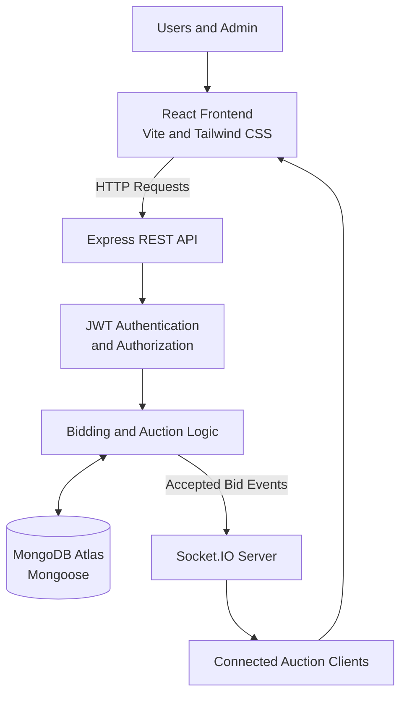

# BidLive — Real-Time Multi-Auction System

BidLive is a MERN stack project I built to make online auctions more interactive and reliable. Users can explore different auctions, place bids, see updates in real time, check their bidding history, and view the auctions they have won. Admins can create auctions and manage their details through a dedicated admin panel.

While building BidLive, I focused on more than just making the interface work. I also worked on handling simultaneous bids, validating bid amounts on the server, preventing duplicate requests, and keeping auction data synchronized across connected users.

## Live Demo

- **Live Application:** https://bidlive-gamma.vercel.app
- **Backend API:** https://bidlive-zkq0.onrender.com
- **GitHub Repository:** https://github.com/sapnajha757/bidlive

## Features

### For Users
- Browse available, upcoming, and completed auctions.
- View auction details, current bids, minimum increments, and remaining time.
- Place bids on active auctions.
- See new bids appear in real time without refreshing the page.
- View personal bidding history and won auctions.
- Register and log in securely.

### For Admins
- Access a separate admin panel.
- Create new auctions and manage existing ones.
- Update auction details, including the starting price, minimum bid increment, description, image, and end time.
- Make changes through the application interface instead of manually editing database records.

### Reliability and Error Handling
- Validate bids on the backend before accepting them.
- Reject bids that are too low or arrive after an auction has ended.
- Handle simultaneous bid requests using conditional database updates.
- Prevent duplicate bid records when the same request is submitted again with the same request ID.
- Send live updates through Socket.IO.
- Handle invalid auction IDs, API errors, and empty auction lists.

## Tech Stack

| Part | Technologies | Why I Used Them |
|---|---|---|
| Frontend | React, Vite | To build a component-based interface and develop it quickly. |
| Styling | Tailwind CSS | To style pages and maintain a consistent layout. |
| Routing | React Router | To navigate between auctions, user pages, and the admin panel. |
| Backend | Node.js, Express.js | To build the API and handle application logic. |
| Database | MongoDB, Mongoose | To store users, auctions, and bidding history. |
| Real-time communication | Socket.IO | To notify connected users when bids change or auctions end. |
| Authentication | JWT, bcrypt | To authenticate users and securely hash passwords. |
| Configuration | dotenv, CORS | To manage environment variables and allow frontend-backend communication. |
| Deployment | Vercel, Render, MongoDB Atlas | To host the frontend, backend, and cloud database separately. |

## How the Application Works

BidLive follows a client-server architecture. The frontend handles the user interface, while the backend validates requests and manages the auction logic. MongoDB stores the application data, and Socket.IO keeps connected clients updated.

1. A user opens BidLive and browses the available auctions.
2. The frontend requests auction data from the Express API.
3. The backend retrieves the required records from MongoDB and returns them to the frontend.
4. When a user submits a bid, the backend checks authentication, the auction's status, the bid amount, and the current auction price.
5. If the bid is valid, the backend updates the auction and records the bid.
6. The server broadcasts a Socket.IO event to users connected to that auction.
7. The frontend updates the displayed price and bid history.

This approach keeps the main bidding rules on the server instead of relying on values submitted by the browser.

## Technical Approach

### 1. Handling Simultaneous Bids

One of the main challenges in an auction system is handling two users who try to place a bid at almost the same time.

For example, suppose the current bid is ₹5,000 and the minimum increment is ₹500. Two users might submit a bid of ₹5,500 simultaneously. If the backend simply reads the current price and updates it later, both requests could incorrectly pass the initial check.

To reduce this risk, BidLive uses a conditional MongoDB `findOneAndUpdate()` operation. The update checks the auction's current state and bid conditions before accepting a change.

The first valid request updates the auction. A competing request based on the old price fails the database condition and is rejected.

This makes the auction update atomic at the single-document level. It does not mean that every operation across multiple collections is automatically transactional.

### 2. Starting Price and Minimum Bid Increment

The starting price determines the minimum price for the first bid when no bids have been placed. After bidding begins, the next valid bid must meet the current bid plus the minimum increment.

For example:

- Starting price: ₹5,000
- Minimum increment: ₹500
- First bid: ₹5,000, if the auction has no bids and the application permits bidding at the starting price.
- If the current bid becomes ₹5,000, the next bid must be at least ₹5,500.

When an admin reduces the starting price before any bids have been placed, the backend also updates the current bid to match it. Once bidding has started, editing the starting price does not overwrite the existing highest bid.

### 3. Real-Time Updates with Socket.IO

Refreshing a page after every bid would make the experience slower and less convenient.

BidLive uses Socket.IO rooms to send updates to users viewing the same auction. The server broadcasts events such as `newBid` and `auctionEnded` to the relevant auction room.

The frontend listens for these events and updates the interface. It also uses bid IDs to avoid displaying the same bid more than once when duplicate events are received.

### 4. Duplicate Request Protection

A network issue or repeated click can cause the same bid request to reach the backend multiple times.

BidLive uses a request ID to recognize repeated requests and a MongoDB unique index as an additional safeguard against duplicate records. The backend can return the previously created bid for a recognized retry rather than creating another record.

### 5. Authentication and Admin Access

Users authenticate through the login API and receive a JWT. Protected routes use authentication middleware to identify the logged-in user.

Admin-only operations, such as creating and editing auctions, also check the user's role on the backend. Hiding an admin link in the frontend is not enough by itself, so authorization is enforced by the API as well.

Passwords are hashed using bcrypt instead of being stored as plain text.

## Project Structure

The project is divided into two main folders:

```text
bidlive/
├── backend/
│   ├── controllers/
│   ├── models/
│   ├── routes/
│   ├── tests/
│   ├── server.js
│   ├── seed.js
│   └── .env.example
│
├── frontend/
│   ├── src/
│   │   ├── components/
│   │   ├── pages/
│   │   └── ...
│   ├── .env.example
│   └── package.json
│
├── README.md
├── PRD.md
└── setup.md
```

The backend contains the API routes, controllers, database models, real-time communication, and test scripts. The frontend contains the pages and reusable components used by users and admins.

## API Overview

| Method | Endpoint | Purpose |
|---|---|---|
| POST | `/api/auth/register` | Register a new account. |
| POST | `/api/auth/login` | Log in and receive a JWT. |
| GET | `/api/auctions` | Retrieve auction listings. |
| GET | `/api/auctions/:id` | Retrieve a particular auction. |
| POST | `/api/auctions` | Create an auction (admin only). |
| PUT | `/api/auctions/:id` | Update an auction (admin only). |
| POST | `/api/auctions/:id/bids` | Submit a bid (authenticated users). |
| GET | `/api/auctions/:id/bids` | Retrieve an auction's bid history. |
| GET | `/api/users/me/bids` | View the logged-in user's bids. |
| GET | `/api/users/me/wins` | View auctions won by the logged-in user. |

## Edge Cases and Error Handling

During development, I considered the following situations because they can affect the reliability of an auction application.

| Scenario | How BidLive Handles It |
|---|---|
| Multiple users bid on the same auction. | Validates and updates bids on the backend and broadcasts accepted changes. |
| Two bids arrive simultaneously. | Uses a conditional atomic database update to prevent both requests from accepting the same stale price. |
| A user submits a bid below the required amount. | Rejects the bid with an appropriate API error. |
| A user bids after an auction ends. | Checks the end time in the controller and the database update condition. |
| The same bid request is repeated. | Uses request IDs and a unique database index to help prevent duplicate records. |
| The same auction is open in multiple tabs. | Uses Socket.IO updates and bid-ID deduplication to keep the displayed history consistent. |
| The current bid changes while another bid is being submitted. | Rejects a request that no longer satisfies the current database conditions. |
| Several auctions end at the same time. | Processes expired auctions independently and emits events to their respective rooms. |
| An invalid auction ID is submitted. | Returns an error response instead of treating the request as a valid auction. |
| An error occurs while recording a bid. | Uses compensating logic to attempt to restore the previous auction state if bid creation fails. |
| No auctions are available. | Returns an empty list and displays a friendly empty state in the frontend. |
| The server or API becomes unavailable or returns an unexpected error. | Returns an appropriate error response where possible, and the frontend should show a clear error message instead of silently failing. |
The error-handling approach covers the expected cases, but recovery from a failure across multiple database operations is not equivalent to a full ACID transaction.

## Running the Project Locally

### Prerequisites

- Node.js 18 or a compatible newer version.
- npm.
- MongoDB Atlas or a running local MongoDB instance.

### 1. Clone the Repository

```bash
git clone https://github.com/sapnajha757/bidlive.git
cd bidlive
```

### 2. Set Up the Backend

```bash
cd backend
npm install
```

Create a `.env` file based on `.env.example` and configure the required values:

```env
PORT=5000
MONGO_URI=your_mongodb_connection_string
JWT_SECRET=your_private_jwt_secret
CLIENT_URL=http://localhost:5173
NODE_ENV=development
```

Use your own database credentials and a strong private JWT secret. Do not commit the `.env` file to GitHub.

If you want to populate a fresh development database with sample data, run:

```bash
node seed.js
```

Then start the backend:

```bash
node server.js
```

The API should be available at `http://localhost:5000`.

### 3. Set Up the Frontend

Open another terminal:

```bash
cd frontend
npm install
```

Create the frontend `.env` file:

```env
VITE_API_URL=http://localhost:5000
```

Start the development server:

```bash
npm run dev
```

Open `http://localhost:5173` in your browser.

For additional setup details, see [`setup.md`](setup.md).

## Testing

The project includes scripts for checking important bidding scenarios and the frontend production build.

**Concurrent bidding test**

```bash
cd backend
node tests/concurrent-bids.js
```

**Edge-case test suite**

```bash
cd backend
node tests/edge-cases-test.js
```

**Starting price edit test**

```bash
cd backend
node tests/test-starting-bid.js
```

**Frontend build check**

```bash
cd frontend
npm run build
```

The test scripts are intended to verify bidding validation, simultaneous requests, repeated requests, auction timing, and starting-price updates. Run them against a configured test database and verify the results in the terminal. Avoid running destructive test scripts against production data.

## Database and Data Persistence

BidLive uses MongoDB to store auction details, user accounts, and bid history.

The deployed application is configured to use MongoDB Atlas so its data is stored separately from the application server. In local development, use either a local MongoDB service or the database configuration supported by the current backend code.

An in-memory database, if enabled for a development or test environment, is temporary: its contents are lost when the process stops. It should not be used as the production database.

## Deployment

The application is split across three services:

- **Vercel:** Hosts the React frontend.
- **Render:** Runs the Node.js and Express backend, including the Socket.IO server.
- **MongoDB Atlas:** Stores persistent application data.

The frontend uses `VITE_API_URL` to communicate with the deployed backend. The backend uses environment variables such as `MONGO_URI`, `JWT_SECRET`, and `CLIENT_URL` to configure its database connection, authentication, and allowed frontend origin.

## Current Limitations and Future Improvements

There are a few areas I would improve before using BidLive for a larger production workload:

- **Multi-instance real-time communication:** A Redis adapter or another shared messaging solution would be needed to coordinate Socket.IO events across multiple backend instances.
- **Transactional consistency:** A MongoDB transaction on a supported replica set would provide stronger consistency when updating an auction and creating its corresponding bid record together.
- **Automated testing:** Expand the automated tests to cover more failure scenarios, authentication cases, and production-like concurrent workloads.
- **Deployment monitoring:** Add structured logging, monitoring, and clearer operational alerts.
- **Auction scheduling:** Improve scheduling and recovery so auction-ending behavior remains reliable during restarts or temporary service interruptions.
- **Production security:** Review rate limiting, input validation, secret rotation, and administrative access before a public production launch.

## What I Learned

Building BidLive helped me understand that a real-time application needs more than a frontend, an API, and a database. The difficult part is making sure that the data remains correct when multiple users interact with the system at the same time.

Working on atomic updates, bid validation, Socket.IO, authentication, admin permissions, and edge-case testing gave me practical experience with the kinds of problems that appear in multi-user applications.

The project is a working foundation that I can continue improving as I learn more about distributed systems, database transactions, testing, and production deployment.

---

## Technical Architecture

BidLive follows a client-server architecture built around the MERN stack. I separated the frontend, backend, database, and real-time communication so that each part has a clear responsibility.

### Architecture Overview



### Main Components

**1. Frontend — React, Vite and Tailwind CSS**

The frontend provides the interface for browsing auctions, viewing bid history, placing bids, and tracking auction results. React components and React Router organize the application into separate pages. Socket.IO Client listens for live auction updates.

**2. Backend — Node.js and Express.js**

The backend handles API requests, authentication, authorization, input validation, and auction operations. Controllers contain the main application logic, while routes define the API endpoints and middleware protects restricted operations.

**3. Database — MongoDB and Mongoose**

MongoDB stores users, auction details, and bid records. Mongoose defines the data models and helps validate and query the stored data. MongoDB Atlas is used for the deployed application so data persists independently of the backend process.

**4. Real-Time Layer — Socket.IO**

Socket.IO sends updates to clients connected to a particular auction. Auction-specific rooms keep events scoped to the relevant auction, allowing users to see accepted bids and auction-ending notifications without repeatedly refreshing the page.

**5. Authentication and Authorization**

JWT is used to authenticate requests from logged-in users, while bcrypt is used to hash passwords. Backend middleware checks user authentication and admin permissions before allowing protected operations.

### Deployment Architecture

The deployed application uses separate services for the frontend, backend, and database.

| Component | Hosting | Responsibility |
|---|---|---|
| Frontend | Vercel | Serves the React application. |
| Backend | Render | Runs the Express API and Socket.IO server. |
| Database | MongoDB Atlas | Stores persistent application data. |

The frontend communicates with the backend through the configured API URL. The backend connects to MongoDB Atlas using a private environment variable, rather than storing database credentials in the source code.

## Technical Approach

I approached the main technical challenges by keeping important business rules on the backend and validating changes against the latest database state.

### 1. Bid Validation and Atomic Updates

The main challenge in a multi-user auction system is ensuring that two users cannot successfully place bids based on the same outdated price.

For example, suppose an auction's current bid is ₹5,000 and the minimum increment is ₹500. Two users submit ₹5,500 at nearly the same time. If both requests independently read ₹5,000 before either update is saved, a simple read-then-write implementation could accept conflicting bids.

To handle this, BidLive uses MongoDB's conditional `findOneAndUpdate()` operation. The database update checks the relevant bid conditions and auction state before modifying the auction document.

- The first request that satisfies the database condition updates the auction.
- A competing request using the outdated price fails the condition.
- The backend rejects the unsuccessful request instead of accepting a stale bid.

This provides atomic protection for the single auction-document update. It does not, by itself, make the auction update and bid-history insertion one atomic multi-document transaction.

### 2. Starting Price and Subsequent Bids

I separated the starting-price rule from the subsequent-bidding rule.

- **Before the first bid:** The minimum valid bid is based on the configured starting price.
- **After bidding begins:** A new bid must meet the current highest bid plus the minimum increment.
- **When an admin changes the starting price:** The current bid is synchronized with the new starting price if no bids have been placed. An existing highest bid is preserved once bidding has started.

Keeping these rules on the backend prevents the frontend from being the only place where bid amounts are validated.

### 3. Real-Time Synchronization

I used Socket.IO so that accepted bids can be reflected across connected clients without a full page refresh.

The process is:

1. A user submits a bid through the REST API.
2. The backend validates the request and attempts the database update.
3. Once the bid is accepted and recorded, the server emits a `newBid` event to the corresponding auction room.
4. Connected clients receive the event and update the displayed price and bid history.
5. An `auctionEnded` event notifies clients when the backend's auction-ending logic marks an auction as ended.

The frontend also uses bid identifiers to avoid rendering the same bid multiple times when duplicate events are received.

### 4. Duplicate Request Handling

Repeated clicks or network retries can send the same bid request more than once. To reduce duplicate records, BidLive uses a request ID to recognize repeated requests and a MongoDB unique index as an additional database safeguard.

When a previously processed request is recognized, the backend can return the existing result rather than creating another bid record. The request-handling logic must also scope the request ID correctly to prevent one user's request from being mistaken for another user's request.

### 5. Authentication and Role-Based Access

I used JWT for authenticated API requests and bcrypt for password hashing. Authentication middleware identifies the requesting user, while admin middleware restricts auction creation and editing to users with the admin role.

The frontend can hide admin-only controls from regular users, but the backend remains responsible for enforcing these permissions. This prevents access control from depending only on the interface.

### 6. Error Handling and Recovery

The backend handles invalid auction IDs, bids below the minimum required amount, expired auctions, and requests that no longer satisfy the current auction conditions.

The bidding flow also uses compensating logic to attempt to restore the auction's previous state if creating the associated bid record fails after the auction document has been updated.

This is a recovery mechanism rather than a full database transaction. A future improvement would be to use MongoDB transactions on a supported replica set so that the auction update and bid-record creation can succeed or fail together.

### 7. Testing Approach

I included test scripts for the main bidding and edge-case scenarios:

- Concurrent bids submitted against the same auction.
- Bids below the required minimum.
- Attempts to bid after an auction ends.
- Repeated requests using the same request ID.
- Starting-price edits before and after bidding begins.
- Invalid auction IDs and empty auction listings.
- Frontend production-build verification.

These tests are intended to check both expected behavior and failure cases. For final verification, they should be run against an isolated test database, and the actual terminal results should be checked before reporting a test as passed.

## Architecture Decisions and Trade-offs

| Decision | Reason | Trade-off |
|---|---|---|
| React frontend separated from Express backend | Keeps the UI and business logic independently organized. | Requires frontend-backend URL and CORS configuration. |
| MongoDB for auction data | Supports flexible document models for auctions and bid history. | Multi-document consistency requires additional care. |
| Conditional atomic database updates | Prevents competing bids from relying solely on stale application reads. | Requires careful query conditions and failure handling. |
| Socket.IO for live updates | Provides immediate event-based updates to connected users. | Multiple backend instances require shared event coordination, such as a Redis adapter. |
| JWT authentication and admin middleware | Protects user-specific operations and admin functionality. | Token lifecycle, secret management, and authorization still need careful handling. |
| Vercel, Render, and MongoDB Atlas | Separates frontend hosting, API hosting, and persistent data storage. | Each service has its own configuration, availability, and deployment considerations. |

## Known Limitations

- The current bidding recovery mechanism is not equivalent to a multi-document ACID transaction.
- Multiple backend instances would need shared Socket.IO event coordination.
- Auction-ending behavior should be tested against server restarts and temporary outages.
- Further load testing, monitoring, rate limiting, and security review would be needed before relying on the system for high-volume or monetary auctions.


**Project:** BidLive — Real-Time Multi-Auction System  
**Repository:** https://github.com/sapnajha757/bidlive  
**Live Demo:** https://bidlive-gamma.vercel.app
